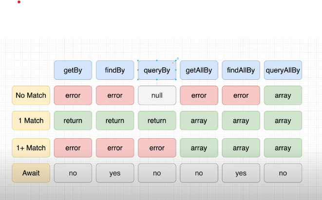
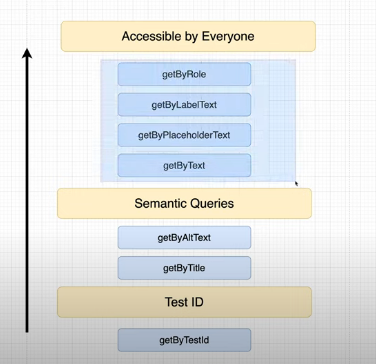

# React Testing Library Crash Course

* <https://www.youtube.com/c/TheNetNinja/videos>
* Importance of Testing
  * Catch Bugs
  * Increase Confidence in Application
  * Speed up QA Time
  * Can Serve as Documentations
* Types of Tests
  * Unit Tests
  * Integration Tests
  * End to End (E2E) Tests
* Structure of Tests
  * Test Block
    * Render a component we want to test
    * Find element we want to interact with
    * Interact with those elements
    * Assert that the results are as expected.
* Intro to Query Methods

* Priority

  